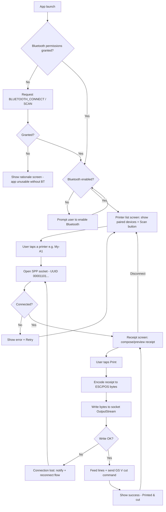

# BRD — Bluetooth Receipt Printer App (AOMU My-A1)

## 1. Objective
Android app that lists Bluetooth printers, connects to an AOMU My-A1 ticket printer, prints receipts, and triggers the paper cutter.

## 2. Scope
**In scope:** list paired/discovered Bluetooth printers, connect/disconnect, compose and send a receipt, trigger paper cut, connection status feedback, error handling.
**Out of scope (v1):** Wi-Fi/USB printing, receipt persistence/history, multi-printer queueing, cloud sync.

## 3. Assumptions (verify against the physical unit — see §7)
- The My-A1 is a generic ESC/POS thermal printer. No public datasheet exists for the AOMU brand, but rebranded ticket printers in this class universally use **ESC/POS over Bluetooth Classic (SPP)**.
- Paper width 58mm (32 chars) or 80mm (48 chars) — check the roll.
- Paper cut = ESC/POS `GS V` command. If the unit has no physical cutter, this command feeds paper only.

## 4. Functional requirements

| ID | Requirement |
|----|-------------|
| FR-1 | Request Bluetooth runtime permissions (`BLUETOOTH_CONNECT`, `BLUETOOTH_SCAN` on Android 12+) |
| FR-2 | Show paired devices; optionally scan for new ones |
| FR-3 | Connect via Bluetooth SPP (UUID `00001101-0000-1000-8000-00805F9B34FB`) |
| FR-4 | Show connection state: Disconnected / Connecting / Connected / Error |
| FR-5 | Build a receipt (header, line items, totals, footer) and send as ESC/POS bytes |
| FR-6 | "Cut paper" action sends `GS V 66 0` (partial cut) after a short feed |
| FR-7 | Surface errors (printer off, out of range, connection dropped) with retry |

## 5. Non-functional requirements
Connect in <5s or fail with a message; print a standard receipt in <3s; no UI freeze during I/O (all Bluetooth work off the main thread); min Android 8.0 (API 26), target latest.

## 6. App flowchart

## 7. Acceptance criteria / hardware verification (do this first)
1. Pair the My-A1 in Android Settings; note its Bluetooth name.
2. Print its **self-test page** (usually: hold feed button while powering on). It prints the actual char-per-line count, baud, and command set — this replaces the missing datasheet.
3. App prints a test receipt with accents/special chars rendered correctly (charset, e.g. CP437/CP850).
4. Cut button physically cuts (or feeds, if cutter absent) without garbling subsequent prints.
