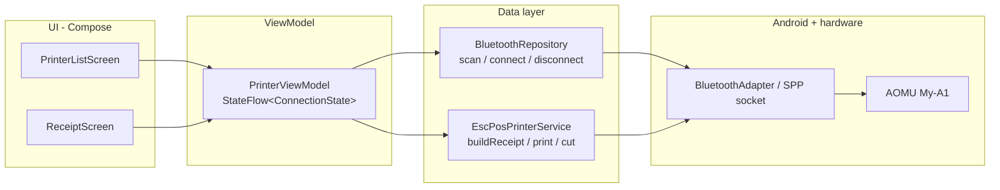

# Architecture — Printer-Android

## 1. Stack

| Concern | Choice | Why |
|---------|--------|-----|
| Language | **Kotlin** | Android standard; coroutines make blocking Bluetooth I/O trivial to keep off the main thread |
| UI | Jetpack Compose | Less boilerplate than XML; state-driven UI matches connection-state model |
| Async | Kotlin Coroutines + `StateFlow` | Bluetooth socket I/O is blocking — run it on `Dispatchers.IO` |
| Pattern | MVVM, single Activity | ViewModel survives rotation, so the socket isn't dropped on config change |
| ESC/POS | [DantSu/ESCPOS-ThermalPrinter-Android](https://github.com/DantSu/ESCPOS-ThermalPrinter-Android) | Mature library: Bluetooth connection + text formatting + `GS V` cut built in. Fallback: raw `BluetoothSocket` + hand-built byte arrays |
| Min SDK | 26 (Android 8.0) | Covers ~98% of devices; permission handling only branches at API 31 |

## 2. Layers

**Rules:** UI never touches Bluetooth APIs directly. All I/O in the data layer on `Dispatchers.IO`. Connection state is a single `StateFlow<ConnectionState>` (sealed class: `Disconnected`, `Connecting`, `Connected(device)`, `Error(msg)`) that both screens observe.

## 3. Key technical facts

- **Transport:** Bluetooth Classic SPP, UUID `00001101-0000-1000-8000-00805F9B34FB`. Connect with `device.createRfcommSocketToServiceRecord(uuid)`; cancel discovery before connecting (discovery kills connection attempts).
- **Permissions:** API 31+ → `BLUETOOTH_CONNECT` + `BLUETOOTH_SCAN` (runtime). API ≤ 30 → `BLUETOOTH`, `BLUETOOTH_ADMIN`, plus `ACCESS_FINE_LOCATION` only if scanning.
- **ESC/POS essentials:**

| Action | Bytes |
|--------|-------|
| Initialize | `ESC @` → `0x1B 0x40` |
| Feed n lines | `ESC d n` → `0x1B 0x64 n` |
| Full cut | `GS V 0` → `0x1D 0x56 0x00` |
| Partial cut | `GS V 66 0` → `0x1D 0x56 0x42 0x00` |
| Bold on/off | `ESC E 1/0` → `0x1B 0x45 0x01/0x00` |
| Center align | `ESC a 1` → `0x1B 0x61 0x01` |

- **Cut gotcha:** feed 3–5 lines before cutting and give the print buffer ~100ms, or the cut lands mid-receipt.
- **Char width:** 32 chars/line (58mm) or 48 (80mm) — confirm via the printer's self-test page.

## 4. Error handling
Wrap connect/write in try/catch on `IOException`; map to `ConnectionState.Error`. On write failure, close socket, offer one auto-reconnect, then surface a Retry button. Always close socket in `onCleared()` of the ViewModel.
