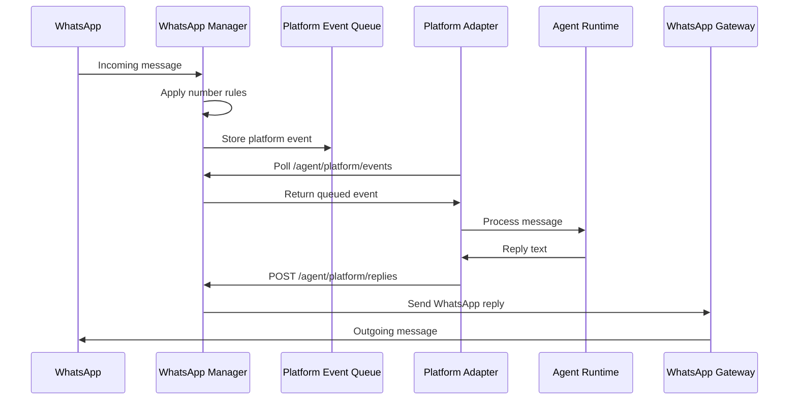
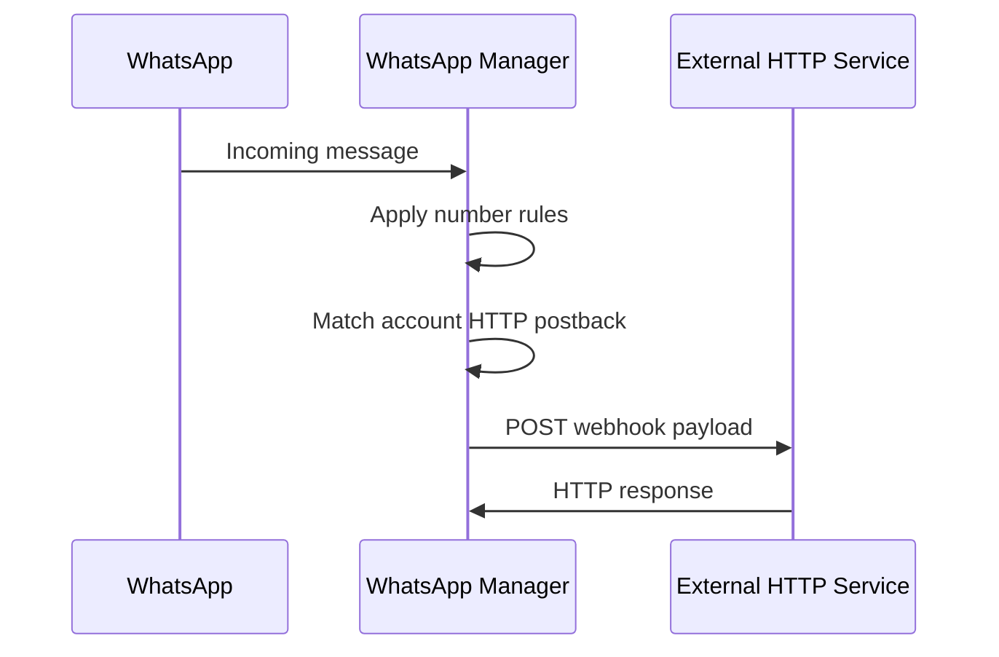
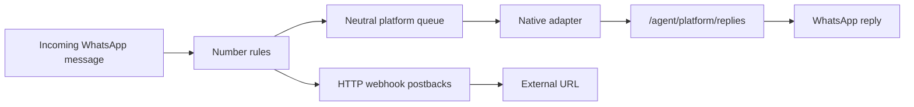

# WhatsApp Manager Postbacks

WhatsApp Manager postbacks are account-scoped HTTP webhook hooks for inbound WhatsApp messages. They are configured in the manager UI and stored by the API.

The native platform adapter path is not configured as a postback. It is an intrinsic manager capability: after an inbound message passes number rules, WhatsApp Manager writes the event to the neutral platform event queue. A compatible adapter can then consume `/agent/platform/events` and post replies through `/agent/platform/replies`.

## Native platform adapter

Use the platform adapter path when inbound WhatsApp messages should be handed to the native adapter. WhatsApp Manager does not call a runtime directly. It stores the inbound event in a neutral platform queue, and the adapter consumes that queue and posts replies back through the manager API.



Manager contract:

```text
GET  /agent/platform/events?cursor=<cursor>
POST /agent/platform/replies
```

Direct callback mode is intentionally not supported. Agent/runtime replies must come back through `/agent/platform/replies`.

## HTTP webhook postbacks

Use the HTTP webhook action for generic outbound integrations such as a CRM, Zapier/Make, analytics, logging, or a custom service. WhatsApp Manager posts the inbound event payload to the configured URL and records the HTTP result.



An HTTP webhook is not the native platform adapter path unless the external service itself implements an adapter-compatible bridge.

## Mental model



## Account scope

HTTP postbacks are configured per WhatsApp account. A postback applies to all chats inside that account.

The postback run still records the concrete chat that triggered it, because every inbound message belongs to a specific conversation. That chat is run metadata, not configuration scope.

Number rules run before platform event queueing and HTTP postback dispatch. If an account has a default deny-all rule, only chats allowed by number rules reach either path.
